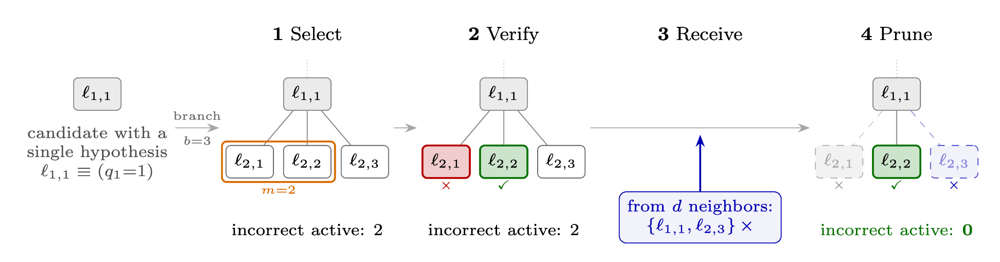

# Absorbing State Phase Transitions in Multi-Agent Search

**Wenwen Zheng, Yuzhe Yang, Helen Qu, Xin Eric Wang, Haewon Jeong**

Paper: [arXiv:2609.38327](https://arxiv.org/abs/2609.38327) (2026).

This repository contains the simulation code, frozen experiment configurations,
processed data, and analysis tools for the paper. We study how communication
suppresses the proliferation of incorrect hypotheses in multi-agent search,
using an absorbing-state framework to predict a critical communication degree.

<p align="center">
  
</p>

<p align="center">
  <em>Schematic of the multi-agent search setup.</em>
</p>

The main experimental components are:

- **Deterministic search:** seeded population simulations, critical-degree scans,
  bootstrap uncertainty, clean-regime classification, and scaling fits.
- **LLM search:** synthetic component search, TCAS software-configuration debugging,
  and physical-mechanism discovery, with C0 (team/fixed communication), C1
  (team/free communication), and I1 (individual/free communication) policies.
- **Analysis and regression checks:** frozen numerical references, protocol tests,
  offline replay support, and pooled LLM result tables.

## Installation

Run commands from the repository root. Python 3.12 is recommended.

```bash
python -m venv .venv
source .venv/bin/activate
python -m pip install -r requirements.txt -r requirements-agents.txt
```

`requirements.txt` pins the deterministic dependencies, including NetworkX because
its seeded graph generator is part of the trajectory definition. The agent
dependencies are also needed for the complete test suite. For Conda, use
`conda env create -f environment.yml`, activate `dc-scaling-reproducible`, and then
install `requirements-agents.txt`. Optional pytest usage requires installing pytest.

## Quick reproduction

```bash
python reproduce.py --test
python reproduce.py --quick
```

The test suite runs offline. Quick reproduction refits the included processed
data and regenerates six figures under `reproduced/quick/`; its validation report
is `reproduced/quick/validation.json`. Some tests skip when optional external or
archived run fixtures are absent.

To regenerate the full deterministic simulation (expensive and resumable):

```bash
python reproduce.py --full --workers 8
```

See [the detailed reproducibility guide](docs/reproducibility.md) for definitions,
estimators, frozen thresholds, seed registries, and numerical validation.

## LLM experiments

```bash
cp .env.example .env
# Edit .env for the endpoint, model and API key used by the selected configuration.
# This validates locally and makes no model calls:
python -m src.agent_system.cli validate \
  --config configs/agents/qwen3.5-4b_seed1/synthetic_C0.json --env-file .env
```

For a configured local Qwen/vLLM endpoint:

```bash
scripts/run_experiments.sh --tag qwen3.5-4b_seed1 --dry-run
# Makes model calls:
scripts/run_experiments.sh --tag qwen3.5-4b_seed1 -j 3 --split degree --workers 7 --concurrency 40
scripts/analyze.sh --tag qwen3.5-4b_seed1
```

For hosted OpenAI models, use the Python CLI/shard commands in
[the LLM experiment guide](docs/llm_experiments.md#hosted-api-and-local-serving).
That guide also covers serving, rule controls, seed pooling, prompts, policies,
and replay. Use the included configurations for reproduction; configuration
generation is only needed when creating a new experiment. Keep API keys in the
ignored `.env` file. LLM runs may incur provider charges.

## Repository structure

| Path | Contents |
|---|---|
| `reproduce.py` | Test, quick-analysis, and full-simulation entry point |
| `src/` | Deterministic simulator and analysis pipeline |
| `src/agent_system/` | Agent scheduler, environments, policies, prompts, replay, and analysis |
| `configs/` | Frozen deterministic registries, seeds, clean criteria, and agent configurations |
| `data/` | Processed deterministic tables and compact bootstrap draws |
| `results/llm_agents/` | Pooled LLM critical-degree tables |
| `scripts/`, `serving/` | Experiment drivers, pooling, analysis, and local vLLM launcher |
| `tests/` | Existing unit and regression tests |
| `provenance/` | Source-archive records, numerical references, and checksum manifests |
| `docs/` | Detailed deterministic and LLM documentation |

## Data and results

Frozen configurations, processed deterministic data, bootstrap draws, and pooled
LLM tables are included. [SUPPLEMENTARY_README.md](SUPPLEMENTARY_README.md) indexes
the archived experiments and numerical results. Raw deterministic trajectories can
be regenerated with `--full`. Raw LLM prompts/replies and event logs are not
included, and this package supplies no public download URL for them. Offline
replay requires a run's saved `requests.jsonl` and `responses.jsonl`; fresh LLM
calls are not bit-reproducible. New runs write to `runs/`, which is ignored by Git.

## Citation

```bibtex
@article{zheng2026absorbing,
  title   = {Absorbing State Phase Transitions in Multi-Agent Search},
  author  = {Zheng, Wenwen and Yang, Yuzhe and Qu, Helen and Wang, Xin Eric and Jeong, Haewon},
  year    = {2026},
  journal = {arXiv preprint arXiv:2609.38327},
  eprint  = {2609.38327},
  archivePrefix = {arXiv},
  primaryClass = {cs.MA},
  url     = {https://arxiv.org/abs/2609.38327}
}
```

Machine-readable citation metadata is provided in [CITATION.cff](CITATION.cff).

## License

**License selection pending author decision.** [LICENSE.txt](LICENSE.txt) is an
explicit placeholder and does not grant a software license. Third-party
dependencies retain their own licenses.
